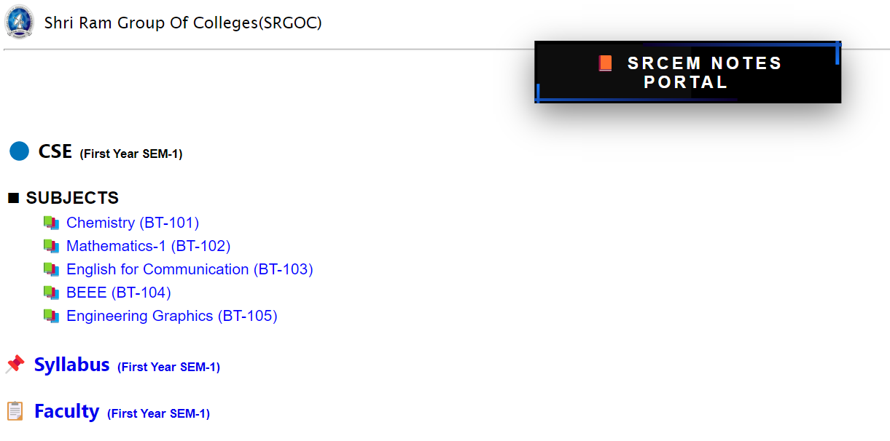
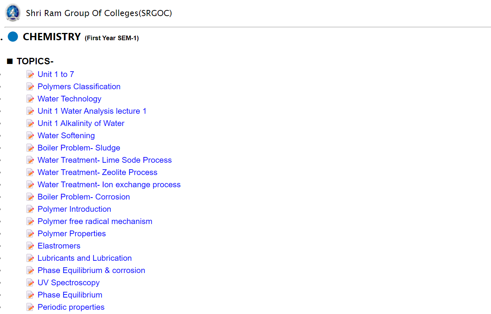

# SRCEM NOTES PORTAL

I made this website for my college for 1st Year students in *lockdown* period to prove all   1. the notes   2. syllabus   3. Faculty info at one place made by our teachers and Prof.

Need of this projects was lack of communication between the newly added students and seniors.

This was pretty helpful in Corona phase.

Implementation:   Used simple `HTML` and `CSS` for desinging and `Google drive` to host the host files.
